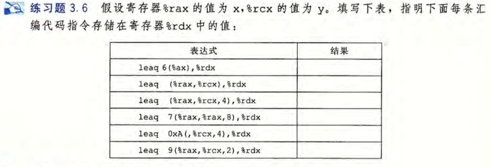

# CSAPP ch3 练习题以及说明


### 3.1 


### 3.2

考查了简单的数据传送指令以及x86-64CPU的16个64bits的通用寄存器及不同bit的标号


### 3.3

考察了简单传送指令mov类两个操作数的限制


### 3.4

**Exer:**


**Solution:**

这个练习涉及到三个不同数据传送指令类的使用，以及它们与C语言的数据类型和转换规则的关系。


**1. long *dp = (long) *sp**;

```C
//局部变量在stack，即虚拟内存中
//这里由于类型一致不涉及到类型转换所以用最简单的mov类即可
movq(%rdi),%rax //memory to register, get sp at rdi, send it to rax
movq %rax,(%rsi) //取寄存器的值送入dp(memory)
```


**2. int *dp = (char)  *sp;**

``` C
//movs类是将较小的数据源送入较大时使用,第一个后缀限定源的大小，第二个限定目的的大小
//movl传送双字
//这里的窄数据类型是有符号的，所以我们用符号扩展不用零扩展
movsbl (%rdi),%eax //将char转换为int并把值送入寄存器 （movsbl将做了符号扩展的字节传输到双字）
movl %eax,(%rsi) //取寄存器的值送入内存rsi
```


**3. unsigned *dp = (char) *sp;**

```C
//将较小的char送入较大的unsigned
//unsigned后面如果没有限定的话默认是int
//这里的窄数据类型是有符号的，所以我们用符号扩展不用零扩展
movsbl (%rdi),%eax //转换char到int并把值送入寄存器
movl %eax, %(rsi) //存4个字节
```


**4. long *dp = (unsigned char) *sp;**

```C
//将1 byte送入较大的 8 bytes(因为是64bit的系统)
//这里的窄数据类型是无符号的，所以我们用零扩展不用符号扩展
//movz类是将较小的数据源送入较大时使用，并且较小的数据源是无符号的
movzbq (%rdi),%rax //读一个字节并零扩展
movq %rax, (%rsi) //存8个字节
```


**5. char *dp = (int) *sp;**

```C
movl (%rdi),%eax //读4个bytes
movb %al,(%rsi) //存低位字节，精度丢失
```


**6. (unsigned char) *dp = (unsigned) *sp;**

```c
//4 bytes -> 1 byte
movl (%rdi), %eax //读4bytes
movb %al,(%rsi) //存低位字节
```


**7. short *dp = (char) *sp;**

```c
//1 byte -> 2 bytes, char有符号，做符号扩展
movsbw (%rdi), %ax
movw %ax,(%rsi)
```


### 3.5

**Exer:**


**Solution:**

可以回去看看```exchange.c```的源代码及其汇编代码。

将mov的过程想象成赋值的过程

汇编，call by reference：

* 参数被存在寄存器中（有参数寄存器di,si,dx,cx）然后传递给函数

	- 函数通过把值存在寄存器或该寄存器的某个低位部分中返回值
 - 可以把寄存器想象成一个指针或者是一个局部变量
   - 当寄存器是指针时，(r_a)的过程就是derenference一个参数的过程
   - 局部变量(内存)通常保存在寄存器中

```c
void decode1(long *xp, long *yp, long *zp) {
  long x = *xp;
  long y = *yp;
  long z = *zp;
  
  *yp = x;
  *zp = y;
  *xp = z;
}
```


### 3.6

**Exer:**




**Solution:**

这里考察了x86-64支持的操作数格式(即各种寻址方式)、leaq的使用以及leaq和mov类指令的区别。

```C
//%rdx是最后要return的值, %rdx存着一个有效地址值

leaq 6(%ax), %rdx //%rdx = 6 + R(%rdx) = x+6
leaq (%rax,%rcx),%rdx //%rdx = x+y
leaq (%rax,%rcx,4),%rdx //%rdx = %rax + 4*%rcx = x+4y
leaq 7(%rax,%rax,8), %rdx //%rdx = 7 + x + 8*(x) = 7+9x
leaq 0xA(,%rcx,4),%rdx //%rdx = 10 + 4*y = 4y+10
leaq 9(%rax,%rcx,2),%rdx //%rdx = 9 + x + 2y
```


这个练习说明了leaq指令的多样性，同时也让你更多地练习解读各种操作数格式。虽然在该练习图片中，有的操作数格式被划分为“内存”类型，但是并没有访存发生，这也体现了leaq和movq的主要区别。

关于“没有访存发生”：

```C
即没有到内存中寻址
  比如 6(%ax),%rdx
  我们知道 Imm(r_a)的操作数应该是M[Imm + R(r_a)], 最外面这个“M[]表示寻址”
  由于这里是leaq指令，我们可以看作没有外面M[]这个寻址过程而是simply Imm + R(r_a)
```


假如说这里是```mov？```

```
movb %al, 1(%rsi)
// means that Move 1 byte from %al to the main memory location %rsi PLUS 1 byte; rsi likely points to a struct and one of its fields is 1 byte from the beginning of the struct.

//1 bytes体现了寻址的过程
```


### 3.7

**Exer:**


**Solution:**

逆向工程再次被证明是学习 C 代码和生成的汇编代码之间关系的有用方式。 解决此类型问题的最好方式是 为汇编代码行加注释 ，说明正在执行的操作信息 。

```c
long scale2(long x, long y, long z){
  long t = 5x+2y+8z;
  return t;
}
```


```c
scale2:
	leaq (%rdi,%rdi,4), %rax //%rax = x+4x = 5x
  leaq (%rax,%rsi,2), %rax //%rax = 5x+2y
  leaq (%rax,%rdx,8), %rax //%rax = 5x+2y+8z
  ret
```


### 3.8

**Exer:**


**Solution:**

这个练习检验你对操作数和算术指令的理解 。

```C
addq %rcx, (%rax) 
//目的:内存的0x100  值：0xFF+0x1 = 0x100  说明：(%rax) = 0x100
subq %rdx, 8(%rax) 
//目的:内存的0x108  值：0xAB-0x3 = 0xA8  说明：内存0x108 = 0xA8
imulq $16, (%rax,%rdx,8)
//目的:内存的0x100+0x3*0x8 = 0x118  值：0x11*0x10 = 0xB0  说明：内存0x108 = 0xB0
incq 16(%rax)
//目的:内存的0x110  值：0x13+0x1 = 0x14  说明：内存0x110 = 0x14
decq %rcx
//目的:寄存器rcx的值  值：0x1-0x1 = 0x0  说明：寄存器rcx的值为0x0
subq %rdx,%rax
//目的:寄存器rax的值  值：0x100-0x3 = 0x0  说明：寄存器rax的值为0xFD

```


### 3.9

**Exer:**


**Solution:**

这个练习使你有机会生成一点汇编代码。答案的代码由 GCC 生成。

将参数 n 加载到寄存器 ％ecx 中 ，它可以用字节寄存器％cl 来指定 sarl 指令的移位量

使用 movl 指令看上去有点儿奇怪，因为 n 的长度是 8 字节，难道不是使用movq吗？但要记住只有最低位的那个字节才指示着移位量。

```c
shift_left3_rightn:
	movq %rdi, %rax //get x
  salq $4, %rax //x<<4
  movl %esi, %ecx //get n (4 bytes)
  sarq %cl, %rax //x>>n
  ret
  
```


### 3.10

**Exer:**


**Solution:**

```C
long arith2(long x, long y, long z) {
  long t1 = x|y;
  long t2 = t1>>3;
  long t3 = ~t2;
  long t4 = z-t3;
  return t4;
}
```


```c
arith2:
	orq %rsi,%rdi //x = x|y
  sarq $3, %rdi //x>>3 (算术右移)
  notq %rdi //x=~x
  movq %rdx,%rax //returnNum = x
  subq %rdi,%rax //returnNum = z-x
  ret //return %rax
	
```


### 3.11

**Exer:**


**Solution:**

* A. 该指令用来将寄存器%rdx设为0，运用了对任意x，x^x = 0这个性质。它对应C语句：x=0；

* B. 将寄存器%rdx设为0更直接的方法使用```movq $0, %rdx```

* C. 通过汇编和反汇编这段代码，我们发现如果使用xorq只需要3个字节；而使用movq的话需要7个字节。
  * 其它将%rdx设为0的方法都以依赖该性质：任何更新低位4字节的指令都会把高位字节设置成0.
  * 因此我们可以使用```xorl %edx,%rdx (2 bytes)```或```$0,%edx(5 bytes)```


### 3.12

**Exer:**


**Solution:**

```C
uremdiv:
	movq %rdx, %r8 //copy qp from %rdx to %r8 because we need %rdx later
  movq %rdi,%rax //move x to lower 8 bytes of %rax(被除数)
  andq $0xFFFF,%rdx //无符号数做零扩展：0-extend to upper 8 bytes of %rax
  //andq指令也可以换成这个指令：movl $0,%edx
  divq %rsi //操作数%rsi给出除数，divide by y
  movq %rax, (%r8) //store quotient at *qp
  movq %rdx,(%rcx) //store remainder at *rp
  ret
```

